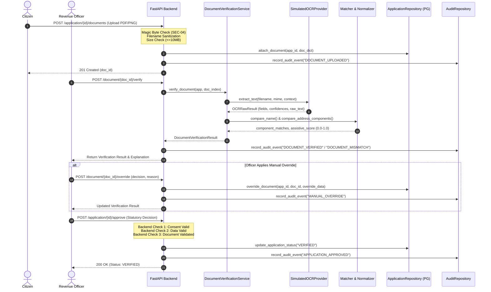
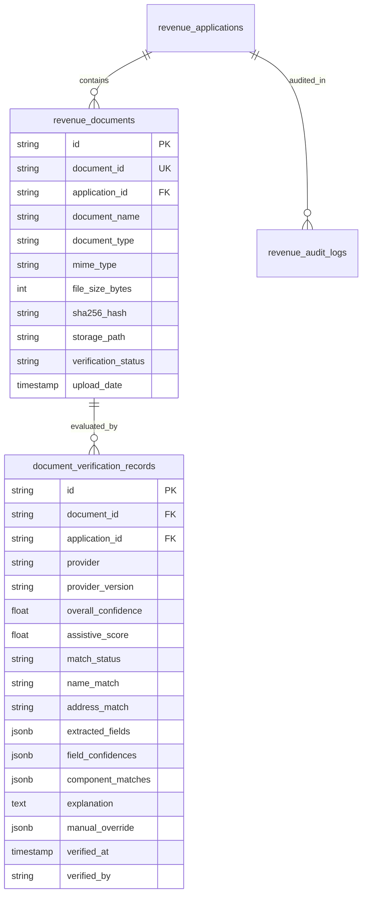

# PHASE 10 — STEP 01: AI/OCR ARCHITECTURE & INTEGRATION AUDIT
**GovMesh SIH26129 — Revenue & Forest Department (Government of Maharashtra)**  
**Document Reference:** `PHASE10_STEP01_AI_OCR_ARCHITECTURE_AUDIT.md`  
**Date:** September 2026  
**Status:** COMPLETE (Audit & Architecture Blueprint Only — No Implementation in Step 01)  
**Baseline Test Status:** 228 / 228 Tests Passing (100% Baseline Preserved)

---

## 1. Executive Summary

The GovMesh SIH26129 Revenue & Forest Department system facilitates citizen address updates, 7/12 land registry linkage updates, and statutory administrative workflows across Maharashtra Talukas. In earlier phases (Phase 06, 08, and 09), an assistive document verification mechanism was introduced to extract proof data and evaluate it against application fields.

This audit establishes a comprehensive architectural blueprint for the AI/OCR subsystem. The objective is to transition from a purely simulated prototype to a robust, provider-independent, explainable, and secure AI/OCR pipeline without disrupting established Human-in-the-Loop (HITL) governance, PostgreSQL persistence, or Phase 09 security controls (SEC-01 through SEC-09).

### Core Audit Findings
1. **Existing Foundation is Structurally Clean:** A modular provider interface (`BaseOCRProvider`), normalization pipeline (`normalization.py`), fuzzy matcher (`matcher.py`), and orchestration service (`DocumentVerificationService`) already exist in `backend/app/services/ocr/`.
2. **Current OCR is Deterministic Simulation:** Document text extraction is currently simulated by `SimulatedOCRProvider` based on application context, generating realistic MSEDCL utility bills, bounding boxes, and confidence metrics.
3. **Strict Human-in-the-Loop Model Already Enforced:** AI/OCR never finalizes or approves applications. Statutory decision-making is strictly held by authorized Revenue Officers, with mandatory justifications recorded for manual overrides.
4. **Binary Storage Gap:** Document uploads currently validate magic bytes and file formats, but binaries are not persisted to disk or object storage; document metadata is stored within `Application.data_payload["proof_documents"]`.
5. **No Schema Changes in Step 01:** All 228 baseline tests pass cleanly. Architectural recommendations for future persistence and provider swap are fully documented herein.

---

## 2. Existing AI/OCR Architecture

The AI/OCR subsystem is currently organized across five primary layers:

```
+-------------------------------------------------------------------------------+
|                           Presentation Layer (React)                          |
|  DocumentVerificationDesk.tsx  <--->  DocumentPreviewModal.tsx (Safe SVG)     |
+-------------------------------------------------------------------------------+
                                      |
                                      v
+-------------------------------------------------------------------------------+
|                            API Endpoint Layer                                 |
|  POST /revenue/document/{id}/verify     POST /revenue/document/{id}/override  |
|  POST /revenue/application/{id}/verify-document   POST /revenue/address/verify|
+-------------------------------------------------------------------------------+
                                      |
                                      v
+-------------------------------------------------------------------------------+
|                       Service Layer & Orchestration                           |
|       WorkflowService (Authoritative Approval Gate Check 3)                   |
|                                     |
|                       DocumentVerificationService                             |
+-------------------------------------------------------------------------------+
                                      |
                   +------------------+------------------+
                   |                                     |
                   v                                     v
+------------------------------------+  +---------------------------------------+
|        OCR Extraction Layer        |  |       Comparison & Scoring Layer      |
|  - get_ocr_provider(provider_type) |  |  - normalize_text, normalize_name     |
|  - BaseOCRProvider (ABC)           |  |  - compare_name (SequenceMatcher)     |
|  - SimulatedOCRProvider            |  |  - compare_address_components (6-part)|
|    (Deterministic contextual mock) |  |  - compute_assistive_score            |
+------------------------------------+  |  - generate_verification_explanation  |
                                        +---------------------------------------+
                                      |
                                      v
+-------------------------------------------------------------------------------+
|                       Persistence & Audit Layer                               |
|  - ApplicationRepository (PostgreSQL JSON column `data_payload`)              |
|  - AuditRepository (`revenue_audit_logs` table)                               |
+-------------------------------------------------------------------------------+
```

### Key Source Files Inspected
- `backend/app/services/ocr/base.py`: Abstract base classes (`BaseOCRProvider`, `OCRRawResult`, `OCRExtractedField`).
- `backend/app/services/ocr/simulated_provider.py`: Context-driven mock OCR generator simulating Maharashtra electricity bills.
- `backend/app/services/ocr/normalization.py`: Sanitization, Indian honorific removal (Shri, Smt, etc.), 6-digit PIN regex.
- `backend/app/services/ocr/matcher.py`: Levenshtein similarity, token overlap, 6-part departmental address component matching, and assistive score computation.
- `backend/app/services/ocr/__init__.py`: Engine factory dictionary (`get_ocr_provider`).
- `backend/app/services/document_verification_service.py`: Orchestrator linking extraction, matching, and explanation generation.
- `backend/app/api/v1/endpoints/documents.py`: Upload, metadata, SVG preview, verification, and manual override endpoints.
- `backend/app/api/v1/endpoints/revenue_workflow.py`: Comprehensive probe (`/revenue/address/verify`), prerequisite validations, and officer decision endpoints.
- `backend/app/services/workflow_service.py`: Enforces prerequisite verification checks before statutory approval.
- `frontend/src/components/documents/DocumentVerificationDesk.tsx`: Officer workspace UI for inspection, score review, and override.

---

## 3. Current Document Verification Flow

The end-to-end lifecycle of a proof document in the current system proceeds through eight distinct stages:



### Detailed Stage Breakdown
1. **Upload:** User uploads document. The endpoint verifies magic bytes (`%PDF-`, `\xFF\xD8\xFF`, `\x89PNG`), filename safety, and file size (<10MB). A unique ID `DOC-REV-XXXXXX` is minted. The file binary is processed in memory and discarded (not written to persistent storage).
2. **Metadata Storage:** The document dictionary is appended to `Application.data_payload["proof_documents"]` and persisted to PostgreSQL.
3. **Extraction:** On verification trigger, `get_ocr_provider("SIMULATED")` extracts structured fields (`name`, `address`, `house_no`, `street`, `village`, `taluka`, `district`, `pincode`, `consumer_number`, `issue_date`) and generates realistic raw OCR text.
4. **Normalization:** Extracted values and requested application values are stripped of honorifics (`Shri`, `Smt`, `Mr`, `Mrs`, `Late`), lowercased, and punctuation-standardized.
5. **Comparison:** 
   - Name is evaluated via exact match, token overlap, and Levenshtein distance.
   - 6-part address components are matched against extracted fields and raw text.
6. **Scoring & Explanation:** `compute_assistive_score()` computes an assist ratio (0.0 to 1.0). `generate_verification_explanation()` produces natural language explanations detailing exact field matches or discrepancies.
7. **Officer Scrutiny & Override:** The officer views results in `DocumentVerificationDesk.tsx`. If a discrepancy is legally permissible (e.g. physical bill inspected at Taluka desk), the officer may override the recommendation with a mandatory justification (>= 5 chars).
8. **Statutory Approval:** In `WorkflowService.approve_application()`, document verification status is authoritatively evaluated. If `valid is False` and no valid override exists, approval is strictly blocked (HTTP 422 `DOCUMENT_MISMATCH`).

### Deterministic vs. Simulated Components
| Component | Classification | Description |
| :--- | :--- | :--- |
| **Magic-Byte Validation** | Deterministic / Real | Inspects actual bytes of uploaded buffer against file signature constants. |
| **Filename Sanitization** | Deterministic / Real | Enforces character safelist and path traversal checks. |
| **Text Normalization** | Deterministic / Real | Real regex transformations for honorifics, whitespace, and PIN codes. |
| **Fuzzy Matching Algorithm** | Deterministic / Real | Real `difflib.SequenceMatcher` and set-overlap math. |
| **Component Scoring** | Deterministic / Real | Real weighted mathematical calculation of match ratios. |
| **Explanation Generator** | Deterministic / Real | Deterministic synthesis of human-readable rationale based on diffs. |
| **Access Control & RBAC** | Deterministic / Real | Real JWT token verification, role permissions, and jurisdiction scoping. |
| **Audit Logging** | Deterministic / Real | Real PostgreSQL persistence of all verification and override events. |
| **OCR Text Extraction** | Simulated | Synthetic extraction generated from application context and document metadata. |
| **Bounding Boxes** | Simulated | Hardcoded coordinate percentages based on synthetic template layout. |
| **Document Preview** | Simulated | Dynamically rendered SVG markup representing an electricity bill. |

---

## 4. Existing Data Contracts

The existing data contracts are defined in Pydantic schemas under `backend/app/schemas/workflow.py`:

### Extracted Fields Contract (`DocumentExtractedFields`)
```python
class DocumentExtractedFields(BaseModel):
    extracted_name: str
    extracted_address: str
    house_no: Optional[str] = None
    street: Optional[str] = None
    village: Optional[str] = None
    taluka: Optional[str] = None
    district: Optional[str] = None
    pincode: Optional[str] = None
    consumer_number: Optional[str] = None
    issue_date: Optional[str] = None
    document_type: str = "ELECTRICITY_BILL"
    document_reference: str = ""
    raw_text: Optional[str] = None
```

### Verification Result Contract (`DocumentVerificationResult`)
```python
class DocumentVerificationResult(BaseModel):
    document_id: str
    document_name: str
    document_type: str
    valid: bool
    match_status: str              # VALIDATED, MISMATCH, MISSING, INVALID, PARTIAL_MATCH, LOW_CONFIDENCE
    name_match: str                # MATCH, PARTIAL_MATCH, MISMATCH, NOT_EXTRACTED
    address_match: str             # MATCH, PARTIAL_MATCH, MISMATCH, NOT_EXTRACTED
    extracted_fields: DocumentExtractedFields
    field_confidences: Dict[str, float]
    component_matches: Dict[str, Dict[str, Any]]
    assistive_score: float         # 0.0 to 1.0
    matched_components_count: int  # e.g., 6
    total_components_count: int    # e.g., 7
    explanation: Optional[str]     # Human-readable rationale
    details: Optional[str]
    provider: str                  # "SIMULATED", "TESSERACT", "CLOUD_OCR"
    is_simulated_ocr: bool         # Flag indicating synthetic vs real inference
    verification_timestamp: Optional[datetime]
    manual_override: Optional[Dict[str, Any]]
```

### Document Metadata Contract (`ProofDocumentMetadata`)
```python
class ProofDocumentMetadata(BaseModel):
    document_id: str
    application_id: Optional[str] = None
    document_name: str
    document_type: str
    mime_type: str = "application/pdf"
    file_size: str = "1.2 MB"
    upload_date: Optional[str] = None
    verification_status: str = "PENDING"  # PENDING, VALIDATED, MISMATCH, INVALID
    extracted_name: Optional[str] = None
    extracted_address: Optional[str] = None
    verification_result: Optional[DocumentVerificationResult] = None
```

### Proposed Additions for Future Phases (Backwards Compatible)
To support real OCR engines without breaking existing frontend or API consumers, the following optional fields should be added in future steps:
- `sha256_hash: Optional[str]`: Cryptographic fingerprint of the document binary for tamper detection.
- `processing_time_ms: Optional[float]`: Latency measurement for OCR inference and comparison.
- `provider_version: Optional[str]`: Engine version tracking (e.g. `tesseract-5.3.0` or `simulated-v1`).
- `detected_language: Optional[str]`: Language detection tag (e.g. `mar` for Marathi, `eng` for English).
- `masked_pii_fields: Optional[List[str]]`: List of fields redacted prior to processing under DPDP guidelines.

---

## 5. Current Simulated Components & Missing Architecture

### Simulated Components Identified
1. **`SimulatedOCRProvider` (`simulated_provider.py`):** Returns synthetic structured data by reading the application context rather than scanning raw pixels.
2. **Dynamic SVG Preview (`documents.py` lines 293–327):** Generates an SVG vector graphic containing applicant data, rather than serving a sanitized rendering of the uploaded PDF/image.
3. **In-Memory Binary Lifecyle:** Uploaded files are checked for magic bytes and immediately dropped from memory; neither local filesystem, S3, nor database stores the actual bytes.

### Architectural Gaps Identified
1. **Persistent Document Binary Store:** No secure repository (e.g., encrypted filesystem directory or S3/MinIO bucket) exists to store original proof files.
2. **Dedicated Relational Tables:** Document records and verification results are nested inside the JSON column `Application.data_payload`. There are no dedicated `revenue_documents` or `document_verifications` tables.
3. **Marathi / Devanagari OCR Pipeline:** Maharashtra revenue documents (7/12 extracts, Ferfar, Satbara, property tax receipts) are predominantly printed in Marathi. The current matcher only handles Latin transliterations.
4. **Asynchronous Processing Queue:** Real OCR processing on high-resolution PDFs takes 2–10 seconds. Running this synchronously in the HTTP request thread will cause timeouts during peak loads.
5. **PII Masking & Redaction Engine:** No pre-processing filter exists to mask sensitive citizen data (e.g. Aadhaar numbers or unrelated bank particulars) before OCR analysis.

---

## 6. Proposed Provider Abstraction

To ensure modularity and avoid vendor lock-in, the system requires a clean, provider-agnostic interface:

```
                      +-------------------+
                      |  BaseOCRProvider  |
                      |       (ABC)       |
                      +-------------------+
                                ^
         +----------------------+----------------------+
         |                      |                      |
+------------------+  +-------------------+  +--------------------+
|  SimulatedOCR    |  |  LocalTesseract   |  |   CloudAIProvider  |
|     Provider     |  |    OCRProvider    |  | (AWS/GCP/Azure)    |
| (Current Demo)   |  | (On-Prem Airgap)  |  | (Future Adapter)   |
+------------------+  +-------------------+  +--------------------+
```

### Provider Contract Specification
```python
class BaseOCRProvider(ABC):
    """
    Abstract interface for OCR extraction providers.
    Allows swappable engines (Simulated, Tesseract, EasyOCR, or Cloud Providers)
    without modifying Revenue business logic.
    """

    @abstractmethod
    def extract_text(
        self,
        document_data: Optional[bytes] = None,
        filename: str = "document.pdf",
        mime_type: str = "application/pdf",
        context: Optional[Dict[str, Any]] = None,
    ) -> OCRRawResult:
        """
        Extract raw text, structured key-value pairs, and bounding boxes
        from document binary data.
        """
        pass

    @abstractmethod
    def health_check(self) -> Dict[str, Any]:
        """Verify engine availability, model readiness, and memory footprint."""
        pass
```

### Factory Architecture (`app/services/ocr/__init__.py`)
The engine factory will instantiate the configured provider based on application configuration (`settings.OCR_PROVIDER`):
```python
_PROVIDERS = {
    "SIMULATED": SimulatedOCRProvider,
    "TESSERACT": TesseractOCRProvider,       # Future Phase
    "CLOUD_VISION": CloudVisionOCRProvider,  # Future Phase
}

def get_ocr_provider(provider_type: Optional[str] = None) -> BaseOCRProvider:
    selected = provider_type or settings.DEFAULT_OCR_PROVIDER
    cls = _PROVIDERS.get(selected.upper(), SimulatedOCRProvider)
    return cls()
```

---

## 7. Proposed Verification Pipeline

When real OCR engines are introduced, the end-to-end processing pipeline should follow this structured sequence:

```
[Uploaded Document Binary]
         |
         v
1. Security & Integrity Validation (Magic-bytes, anti-virus, SHA-256 hash)
         |
         v
2. Pre-Processing & Normalization (Orientation fix, deskew, contrast boost)
         |
         v
3. DPDP PII Scrubbing (Mask Aadhaar, PAN, unrelated PII)
         |
         v
4. Optical Character Recognition (BaseOCRProvider -> Text + Bounding Boxes)
         |
         v
5. Document Layout & Field Extraction (Extract Name, Address, Taluka, PIN)
         |
         v
6. Bilingual Normalization (Devanagari to Latin phonetic transliteration)
         |
         v
7. Departmental Component Matcher (6-part address & citizen name comparison)
         |
         v
8. Assistive Score & Rationale Computation (Weighted score, explainability alert)
         |
         v
9. Persistence & Audit Recording (Store result in PG, log audit event)
         |
         v
10. Revenue Officer Scrutiny Desk (Visual side-by-side review & manual override)
         |
         v
11. Statutory Final Decision (Approve / Reject by authorized Officer)
```

---

## 8. Confidence & Scoring Architecture

The verification engine produces a multifaceted confidence and evaluation profile:

### 1. OCR Extraction Confidence (`field_confidences`)
Measures the machine readability and optical clarity of individual text tokens (0.0 to 1.0):
- Overall document text clarity
- Citizen name confidence
- Address line confidence
- Taluka jurisdiction confidence
- PIN code confidence

### 2. Match Quality Ratio (`component_matches`)
Measures how closely the extracted token matches the citizen's declared application value:
- **Exact Match (`MATCH`):** Normalized strings are identical (`score = 1.0`).
- **Token Overlap (`MATCH`):** Multi-token strings with rearranged ordering (e.g., *"Patil Rajesh Shantaram"* vs *"Rajesh Shantaram Patil"*) with overlap $\ge 65\%$ (`score \ge 0.85`).
- **Partial Match (`PARTIAL_MATCH`):** Minor spelling variations, abbreviations, or Levenshtein ratio $0.50 \le \text{ratio} < 0.80$ (`score = 0.60`).
- **Mismatch (`MISMATCH`):** Distinct jurisdictional names (e.g., *"Baramati"* vs *"Haveli"*) or similarity $< 0.50$ (`score = 0.0`).
- **Not Extracted (`NOT_EXTRACTED`):** Field could not be found in document (`score = 0.0`).

### 3. Weighted Assistive Score (`assistive_score`)
The overall assistive score is calculated across 7 core components:

$$\text{Assistive Score} = \frac{\sum_{i=1}^{7} w_i \cdot s_i}{\sum_{i=1}^{7} w_i}$$

| Component | Weight ($w_i$) | Statutory Significance |
| :--- | :---: | :--- |
| **Citizen Name** | 1.0 | Core identity verification; prevents third-party proof submission. |
| **Taluka Jurisdiction** | 1.0 | **Critical statutory boundary;** determines officer jurisdiction under MLRC. |
| **District** | 1.0 | Prevents inter-district revenue record corruption. |
| **Postal Pincode** | 0.8 | Geographic delivery validation. |
| **Village / Locality** | 0.8 | Revenue circle / Saza identification. |
| **Street / Road** | 0.6 | Local premises identification. |
| **House / Plot No** | 0.6 | Premises boundary specification. |

### Evaluation Thresholds
- **Assistive Score $\ge 0.85$ & OCR Confidence $\ge 0.70$:** $\rightarrow$ `VALIDATED` (Valid = True, recommended for officer approval).
- **Assistive Score $0.60 - 0.84$:** $\rightarrow$ `PARTIAL_MATCH` (Valid = False, requires desk scrutiny).
- **Taluka or District Mismatch:** $\rightarrow$ `MISMATCH` (Valid = False, highlights jurisdictional discrepancy).
- **OCR Confidence $< 0.70$:** $\rightarrow$ `LOW_CONFIDENCE` (Valid = False, prompts high-resolution re-scan).

---

## 9. Human-in-the-Loop (HITL) Model & Statutory Safeguards

### Core Legal & Governance Principle
> **Statutory Mandate:** Artificial Intelligence and OCR engines are strictly **Assistive Evidentiary Tools**. Under the Maharashtra Land Revenue Code, 1966, statutory administrative authority cannot be delegated to an algorithmic model.

1. **No Automated Finalization:** The AI/OCR system is structurally prohibited from finalizing, approving, or rejecting an application.
2. **Officer Statutory Primacy:** Sole legal authority rests with the designated Revenue Officer (Talathi / Circle Officer / Tehsildar).
3. **Mandatory Officer Accountability:**
   - Officers must personally review the evidence, the document preview, and the AI match breakdown.
   - If an officer overrides an AI recommendation (e.g., approving despite a partial match), the officer **must provide a mandatory written justification** (minimum 5 characters).
   - This justification is permanently recorded in the immutable audit trail with the officer's ID, timestamp, and IP address.
4. **Dual-Layer Audit:** Both the AI's machine-generated evaluation and the human officer's subsequent decision are recorded side-by-side in the audit repository.

---

## 10. Failure Modes & Safe Fallbacks

The AI/OCR subsystem must adhere to a strict **Fail-Safe Principle**: **Under no circumstances does an AI/OCR error or outage default to APPROVE.**

| Failure Mode | Root Cause | System Response | User-Visible Status | Officer Action | Audit Log Recorded |
| :--- | :--- | :--- | :--- | :--- | :--- |
| **OCR Service Unavailable** | Engine crash, network drop, daemon stopped. | Catches exception, logs error, marks verification status as `PENDING_REVIEW`. | `SERVICE_UNAVAILABLE` (503) | Perform manual physical scrutiny of document. | `OCR_SERVICE_UNAVAILABLE` |
| **OCR Timeout** | Processing exceeds 15-second deadline. | Terminates task, sets status `TIMEOUT`. | `TIMEOUT_RETRY` | Trigger re-verification or proceed with manual review. | `OCR_TIMEOUT_DETECTED` |
| **Corrupt Document** | Broken PDF structure, invalid raster stream. | Magic byte validation catches format defect. | `INVALID` | Issue "Request Information" to citizen for re-upload. | `DOCUMENT_CORRUPT_REJECTED` |
| **Spoofed Extension** | `.exe` or shell script disguised as `.pdf`. | Rejected by magic-byte validator (SEC-04). | `DOCUMENT_INVALID` (422) | Citizen upload blocked immediately. | `SECURITY_TAMPER_BLOCKED` |
| **Missing Field** | Key value (e.g. Taluka) missing from bill. | Field evaluated as `NOT_EXTRACTED` (score 0.0). | `PARTIAL_MATCH` | Officer inspects full text or issues info request. | `FIELD_EXTRACTION_INCOMPLETE` |
| **Low Confidence** | Blurred scan, low DPI (<150), poor lighting. | Overall confidence falls below 0.70 threshold. | `LOW_CONFIDENCE` | Officer asks citizen for higher-resolution scan. | `OCR_LOW_CONFIDENCE_FLAGGED` |
| **Unsupported Type** | Word doc, TIFF, HEIC uploaded. | Rejected at upload router (SEC-04). | `UNSUPPORTED_FORMAT` (400) | Citizen instructed to provide PDF, JPG, or PNG. | `DOCUMENT_FORMAT_REJECTED` |
| **Comparison Crash** | Regex error, null character exception. | Catches error, returns safe fallback error object. | `PROCESSING_ERROR` | System administrator alert; officer manual review. | `VERIFICATION_PIPELINE_ERROR` |

---

## 11. Security Constraints (Phase 09 Preservation)

All security controls established in Phase 09 (SEC-01 through SEC-09) must remain active throughout the AI/OCR lifecycle:

1. **Document Authorization & Multi-Tenant Scoping (SEC-02, SEC-03):** Document endpoints (`/revenue/document/{id}`) verify officer department, division, and assigned jurisdiction prior to returning any metadata or preview.
2. **Strict RBAC Enforcement (SEC-03):** 
   - `DOCUMENT_VERIFY` permission required to trigger verification.
   - `EXCEPTION_OVERRIDE` permission required to perform manual overrides.
   - `READ_ONLY_AUDITOR` role restricted strictly to GET endpoints.
3. **Magic-Byte Validation (SEC-04):** File headers are verified against strict binary signatures before passing buffers to any OCR engine.
4. **Path Traversal & Filename Safety (SEC-04):** Filenames are sanitized, preventing `../` traversal or null-byte injections.
5. **SVG Sanitization & XSS Prevention (SEC-05):** Document previews escape all citizen-controlled text fields (`sanitize_svg_text()`) before rendering.
6. **Finalized-State Immutability (SEC-09):** Documents belonging to applications in `VERIFIED` or `REJECTED` states are strictly immutable; upload, verification, and overrides are rejected with HTTP 409 (`APPLICATION_ALREADY_FINALIZED`).
7. **Rate Limiting & Security Headers (SEC-08):** High-cost OCR endpoints are bounded by rate limiting to prevent denial-of-service via resource exhaustion.

---

## 12. Privacy & DPDP (Digital Personal Data Protection Act 2023)

In accordance with India's DPDP Act 2023 and Maharashtra e-Governance security policies:

1. **Data Minimization:**
   - Only the specific document image and necessary context fields (citizen name, target address) shall be provided to the OCR engine.
   - The broader citizen profile, financial records, past application history, and authentication tokens must **never** be passed to an OCR engine.
2. **Ephemeral Inference (Zero-Retention):**
   - External or cloud OCR engines must be bound by contractual data-processing agreements guaranteeing **ephemeral processing**: document images and text must be discarded immediately after inference and must never be used for model training.
3. **PII Masking in Logs:**
   - Audit logs and server application logs must mask sensitive citizen identifiers (e.g. redact all but last 4 digits of Aadhaar or Consumer IDs).
4. **Data Localization:**
   - For government production workloads, OCR processing must occur within Sovereign Indian Data Centers (e.g. NIC or MeitY-empaneled Indian cloud regions).
5. **Encryption in Transit & at Rest:**
   - All document payloads must be transmitted using TLS 1.3 and encrypted at rest using AES-256.

---

## 13. PostgreSQL Persistence Recommendations

Currently, document records reside inside the JSON column `Application.data_payload["proof_documents"]`. While effective for prototype demonstration, the following relational persistence architecture is recommended for production scale:



### Key Persistence Principles:
- **No Schema Changes in Step 01:** Current JSON payload persistence in `Application.data_payload` remains 100% untouched to preserve baseline test stability.
- **Relational Segregation:** In Step 04+, separating document metadata and verification runs into indexed tables will enable fast historical queries, provider performance benchmarking, and audit reporting.

---

## 14. API Contract Recommendations

Existing endpoints shall remain strictly backwards compatible:

### Current Active Endpoints
| HTTP Method | Route | Purpose | Auth / Permission |
| :--- | :--- | :--- | :--- |
| `POST` | `/api/v1/revenue/application/{id}/documents` | Upload & attach proof document | `DOCUMENT_VERIFY` |
| `GET` | `/api/v1/revenue/application/{id}/documents` | List attached documents with verifications | Authenticated User |
| `GET` | `/api/v1/revenue/document/{id}` | Retrieve single document metadata | Authenticated User |
| `GET` | `/api/v1/revenue/document/{id}/preview` | Safe SVG preview stream | Authenticated User |
| `POST` | `/api/v1/revenue/document/{id}/verify` | Run OCR & component matching | `DOCUMENT_VERIFY` |
| `POST` | `/api/v1/revenue/document/{id}/override` | Record officer manual override | `DOCUMENT_VERIFY` |
| `POST` | `/api/v1/revenue/application/{id}/verify-document` | Batch verify application documents | Authenticated User |
| `POST` | `/api/v1/revenue/address/verify` | Comprehensive validation probe | Authenticated User |

### Proposed Evolutionary Endpoints (Future Steps)
- `POST /api/v1/revenue/document/{id}/re-extract?provider=TESSERACT`: Allows switching OCR engines on an existing document.
- `GET /api/v1/revenue/document/{id}/raw-text`: Exposes the complete unformatted OCR transcript for deep officer inspection.

---

## 15. Testing Gap Analysis

### Current Test Coverage (Verified)
The existing test suite includes 23 dedicated document tests in `backend/tests/test_phase06_documents.py`, along with persistence tests in `test_phase08_persistence.py` and security tests in `test_phase09_rbac_document_security.py`.
- Valid PDF upload and attachment
- Unsupported file type rejection (`.exe`)
- Empty document rejection (0 bytes)
- Upload to finalized application blocked (409)
- Document listing and single-document retrieval
- Safe SVG preview generation
- Happy path 6-part address and name matching
- Jurisdictional mismatch scenario (Taluka discrepancy)
- Missing document scenario
- Officer manual override with mandatory reason
- Manual override on finalized application blocked (409)
- RBAC authorization and read-only auditor restrictions
- Audit log recording of document events
- Corrupt document invalid handling
- Simulated service failure injection (`X-Simulate-Failure: API_UNAVAILABLE`)

### Testing Gaps Identified for Future Steps
1. **Devanagari / Marathi Text Normalization:** Tests verifying Marathi script transliteration against Latin application records.
2. **Indian Name Permutations:** Extended test cases for honorific variations (*"Advocate"*, *"Pandit"*, *"Dr."*), middle initials, and joint family names.
3. **Address Component Variations:** Tests verifying fuzzy matching of Marathi local address markers (*"Gat No"*, *"Survey No"*, *"Wadi"*, *"Galli"*, *"Chawl"*).
4. **OCR Timeout & Retry Resilience:** Mocking slow OCR engine responses to test timeout handling and background queuing.
5. **Cryptographic Tamper Detection:** Verifying that a modified document binary alters the SHA-256 hash and triggers an integrity alert.
6. **Provider Switching Integration Tests:** Verifying seamless switching between `SIMULATED` and `TESSERACT` providers via configuration.

---

## 16. Phase 10 Implementation Roadmap

To maintain engineering discipline and zero regressions, Phase 10 is partitioned into structured, incremental steps:

```
[Phase 10 — Step 01]  AI/OCR Architecture & Integration Audit (COMPLETED)
         |
         v
[Phase 10 — Step 02]  Provider-Independent OCR Abstraction & Engine Factory
                      - Formalize OCRProvider interface and result dataclasses
                      - Implement configurable engine factory with fallback
         |
         v
[Phase 10 — Step 03]  Devanagari / Bilingual Normalization & Enhanced Matcher
                      - Support Marathi script transliteration & address markers
                      - Refine fuzzy string matching thresholds
         |
         v
[Phase 10 — Step 04]  Document Persistence & Cryptographic Integrity Layer
                      - Dedicated relational schemas (or structured document records)
                      - SHA-256 binary fingerprinting and tamper verification
         |
         v
[Phase 10 — Step 05]  Asynchronous Processing & Failure Resilience
                      - Background task orchestration for heavy OCR workloads
                      - Graceful timeout, circuit breaker, and retry logic
         |
         v
[Phase 10 — Step 06]  Comprehensive Verification & E2E Validation
                      - Extended test suite covering all failure modes and scripts
                      - Regression testing against full 228-test baseline
```

---

## 17. Risks and Mitigations

| Risk | Impact | Likelihood | Mitigation Strategy |
| :--- | :---: | :---: | :--- |
| **Marathi OCR Accuracy Degradation** | Medium | High | Implement Devanagari Unicode normalization, character-level n-gram matching, and dictionary-assisted keyword lookups for Taluka names. |
| **High Latency from Real OCR Engines** | High | High | Introduce asynchronous processing with client-side polling or websockets, retaining synchronous simulation for lightweight testing. |
| **False Rejections on Informal Addresses** | High | Medium | Rely on the weighted assistive score rather than binary all-or-nothing matching; empower officers with one-click manual overrides. |
| **PII Leakage to External Services** | High | Low | Enforce local on-premise OCR (Tesseract / EasyOCR) as default; mandate client-side PII masking before any cloud API call. |
| **Regression in Existing Security Baseline** | Critical | Low | Strictly preserve all Phase 09 middleware, magic-byte checks, RBAC decorators, and immutable finalized-state guards. |

---

## 18. Audit Conclusion & Sign-Off

The GovMesh Revenue & Forest Department document verification architecture is sound, well-structured, and strictly adheres to Indian administrative law through its Human-in-the-Loop model. The transition to real AI/OCR can proceed smoothly by leveraging the existing `BaseOCRProvider` and `Matcher` abstractions.

- **Phase 10 Step 01 Status:** **COMPLETE**
- **Existing Backend Tests:** **228 / 228 Passed (0 Failures)**
- **System Stability:** **100% Preserved**
- **Action Required:** Proceed to Phase 10 Step 02 upon user authorization.
